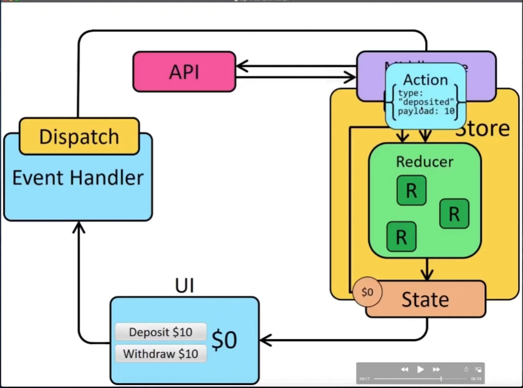

# Todo App

Budget application using react and redux toolkit.

# Provider

```jsx
import { Provider } from "react-redux";

<Provider store={store}>
  <App />
</Provider>;
```

# Store

```jsx
import { configureStore } from "@reduxjs/toolkit";
import todoReducer from "./todoSlice";

export default configureStore({
  reducer: {
    todos: todoReducer,
  },
});

```

# useSelector

```jsx
const todos = useSelector((state) => state.todos);
```

# useDispatch

```jsx
const dispacth = useDispatch();
const handleDeleteClick = () => {
  dispacth(deleteTodo({ id }));
};
```

# Redux Flow


